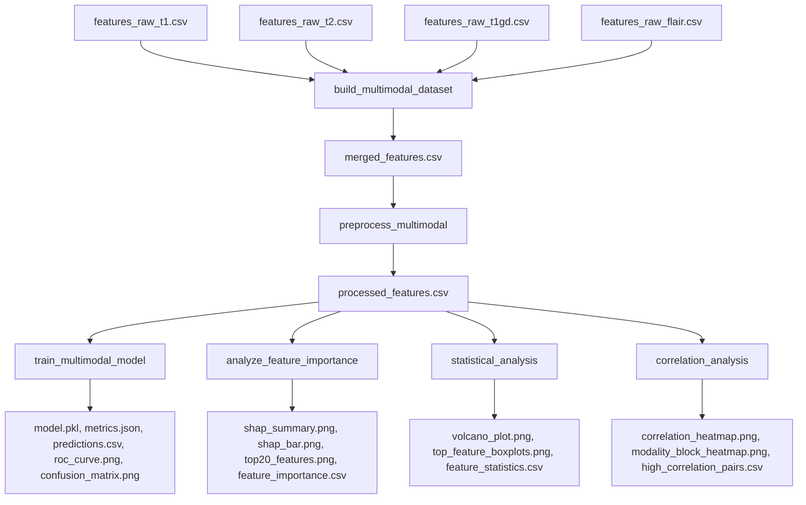

# Multimodal Lobewise Subregion Modelling for Survival Risk Analysis

## 1. Overview

This pipeline constructs and interprets a **multimodal lobewise-subregion survival risk classifier** from pre-extracted spatial feature sets across four MRI sequences: T1-weighted, T2-weighted, contrast-enhanced T1 (T1GD), and FLAIR. The objective is to identify which anatomical lobe–subregion combinations across modalities most strongly associate with short-term (≤12 months) versus longer-term survival in glioblastoma patients, using interpretable machine learning and robust statistical testing.

## 2. Problem Statement

Approximately 500 UCSF-PDGM patients have tumour segmentations co-registered to an SRI24 atlas, from which 16 spatial overlap features per modality have been previously extracted. These features capture the fraction of enhancing tumour (en), non-enhancing core (nc), and peritumoural edema (ed) within each of four lobes (frontal, temporal, parietal, occipital), plus four global tumour-burden metrics.

**Key questions:**
- Which lobe–subregion combinations across the four MRI modalities carry the strongest survival risk signal?
- Does multimodal fusion add independent spatial information, or do different sequences capture essentially the same anatomical patterns?
- Can a standard gradient-boosted model (XGBoost) stratify survival risk using only these coarse lobewise features?

## 3. Dataset Description

The input consists of four pre-extracted CSV files (`features_raw_{t1,t2,t1gd,flair}.csv`), each containing 16 spatial features per patient plus survival metadata. No raw NIfTI processing or atlas registration is performed in this pipeline.

**Filtering criteria:**
- `OS_months` must be present (not NaN)
- `lobe_assignment_reliable` must be `True`

| Step | Patients | Features |
|---|---|---|
| Raw (per modality) | ~499 | 18 (16 features + OS_months + lobe_assignment_reliable) |
| After filtering | 493 | — |
| After inner join across 4 modalities | 493 | 64 (16 × 4 modalities) |
| After preprocessing (imputation + scaling) | 493 | 64 |

**Risk labelling:** `risk_label = 1` if `OS_months ≤ 12` (high-risk), else `0` (low-risk). Class distribution: 276 low-risk, 217 high-risk.

| Modality | Feature Type | Count |
|---|---|---|
| T1 | Lobar + global spatial ratios | 16 |
| T2 | Lobar + global spatial ratios | 16 |
| T1GD | Lobar + global spatial ratios | 16 |
| FLAIR | Lobar + global spatial ratios | 16 |
| **Total** | | **64** |

## 4. Pipeline Architecture



## 5. Folder Structure

```
src/multimodal_lobewise/
├── __init__.py
├── build_multimodal_dataset.py    # Merge 4 modality CSVs into a single multimodal table
├── preprocess_multimodal.py       # Median imputation + StandardScaler, save artifacts
├── train_multimodal_model.py      # Train XGBoost with early stopping, evaluate, save model
├── analyze_feature_importance.py  # SHAP + XGBoost importance, grouped by modality/lobe/subregion
├── statistical_analysis.py        # Mann-Whitney U, FDR correction, Cohen's d, volcano plot
└── correlation_analysis.py        # Pearson/Spearman matrices, redundancy quantification

outputs/multimodal_lobewise/
├── merged_features.csv
├── processed_features.csv
├── scaler.pkl
├── imputer.pkl
├── model.pkl
├── metrics.json
├── predictions.csv
├── roc_curve.png
├── confusion_matrix.png
├── feature_importance.csv
├── shap_summary.png
├── shap_bar.png
├── top20_features.png
├── feature_statistics.csv
├── volcano_plot.png
├── top_feature_boxplots.png
├── high_correlation_pairs.csv
├── correlation_heatmap.png
├── modality_block_heatmap.png
├── correlation_summary.json
├── modality_importance.csv
├── lobe_importance.csv
└── subregion_importance.csv
```

## 6. Methodology

### 6.1 Dataset Construction

Each modality CSV contains 18 columns: `patient_id`, 16 spatial features (4 global + 12 lobar), `OS_months`, and `lobe_assignment_reliable`. The builder module (`build_multimodal_dataset.py`) reads all four CSVs, applies filtering, creates the binary risk label at a 12-month threshold, renames each feature column with its modality prefix (e.g. `frontal_nc_ratio` → `T1_frontal_nc_ratio`), and performs an **inner join on `patient_id`** so that only patients present in all four modalities are retained (n = 493). The four metadata columns (`patient_id`, `OS_months`, `lobe_assignment_reliable`, `risk_label`) are kept from the T1 modality to avoid duplication.

### 6.2 Preprocessing

The processor module (`preprocess_multimodal.py`) separates metadata (`patient_id`, `risk_label`) from the 64 feature columns, verifies no metadata leakage and all-numeric types, applies **median imputation** via `sklearn.impute.SimpleImputer`, then **standard scaling** (`sklearn.preprocessing.StandardScaler`). Both fitted transformers are serialised as `imputer.pkl` and `scaler.pkl` for later reuse. Strong assertions enforce no remaining NaNs and exact column preservation.

### 6.3 Model Training

An **XGBoost classifier** is trained on a stratified 80/20 train-test split (`random_state=42`). Hyperparameters are set conservatively (`n_estimators=300`, `max_depth=4`, `learning_rate=0.03`, `subsample=0.8`, `colsample_bytree=0.8`) with `scale_pos_weight` computed from the training class distribution to handle imbalance. Early stopping on the test set is used as a proxy validation. Five metrics are reported: accuracy, precision, recall, F1-score, and ROC-AUC, along with the confusion matrix and full classification report.

### 6.4 SHAP Analysis

SHAP (SHapley Additive ExPlanations) via `TreeExplainer` decomposes each prediction into additive feature contributions. **Positive SHAP** values push the prediction towards high-risk; **negative SHAP** values push towards low-risk. Feature contributions are aggregated by **modality**, **lobe**, and **subregion** to identify the anatomical axes with the strongest survival signal. SHAP and XGBoost gain importance are compared side by side.

### 6.5 Statistical Analysis

For each of the 64 features, a **two-sided Mann-Whitney U test** compares the distributions of the high-risk and low-risk groups. Effect sizes are reported as **Cohen's d** (positive = higher in high-risk). **Benjamini-Hochberg FDR correction** controls for multiple testing across the 64 hypotheses. A volcano plot visualises effect size against significance, and boxplots of the top significant features are generated.

While SHAP importance reflects *model-based* contribution magnitude, statistical testing reflects *univariate group separation* — a feature can be statistically significant (group means differ) without being important to the model (if its signal is redundant with other features), and vice versa.

### 6.6 Correlation Analysis

Pearson and Spearman correlation matrices (64 × 64) are computed across all features. Highly-correlated pairs (|r| > 0.80, |r| > 0.90) are extracted, annotated with whether they share modality, lobe, or subregion, and aggregated into within-modality, cross-modality, and same-subregion cross-modality redundancy summaries. A clustered heatmap and a modality-block heatmap visualise the correlation structure.

## 7. Results

### 7.1 Model Performance

| Metric | Value |
|---|---|
| Accuracy | 0.556 |
| Precision | 0.500 |
| Recall | 0.409 |
| F1-score | 0.450 |
| ROC-AUC | 0.562 |

The AUC of 0.562 indicates a modest but above-chance predictive signal. The low recall for the high-risk class (0.41) suggests that coarse lobewise features alone provide limited discriminative power for individual-level survival stratification, though group-level anatomical patterns are detectable (see §7.2).

### 7.2 Key Anatomical Findings

| Finding | Evidence |
|---|---|
| **Frontal enhancing burden** is the strongest spatial correlate of high-risk across all modalities | `frontal_en_ratio` is top-ranked by both SHAP and statistical significance across T1, T2, T1GD, and FLAIR (Cohen's d ≈ +0.40, FDR p ≈ 1.4 × 10⁻⁷) |
| **Temporal lobe patterns** show the second-strongest association with risk | `temporal_en_ratio` and `temporal_ed_ratio` appear among top-10 features by both SHAP and statistical tests |
| **T1 and T2 modalities dominate the predictive signal** | Mean |SHAP|: T1 (0.109) > T2 (0.070) > T1GD (0.025) > FLAIR (0.006) |
| **Global oedema/total ratio** is negatively associated with high-risk | `global_ed_total_ratio` shows a consistent negative Cohen's d across all four modalities (d ≈ −0.33), suggesting that a higher proportion of oedema relative to total tumour volume is associated with longer survival |
| **Non-enhancing core (nc)** features show weaker but significant group differences | `frontal_nc_ratio` is significant across all modalities (d ≈ +0.18, FDR p ≈ 3.6 × 10⁻⁵) |

### 7.3 Correlation Findings

| Measure | Mean \|r\| |
|---|---|
| Within-modality feature pairs | 0.25 |
| Cross-modality feature pairs (all) | 0.30 |
| Same-subregion cross-modality pairs (e.g. T1_frontal_en vs T2_frontal_en) | 0.46 |
| Same-subregion cross-modality pairs exceeding |r| > 0.90 | 486 pairs |

These results indicate that multimodal fusion in this lobewise framework captures **mostly shared anatomical information** rather than independent complementary signal. Same-subregion measurements across different MRI sequences are highly correlated (mean r = 0.46, with many approaching 1.0), suggesting that spatial overlap ratios are largely sequence-invariant within the same patient. **25 of 64 features** remain statistically significant after FDR correction, confirming that group-level differences are robust but often redundant across sequences.

## 8. Important Visual Outputs

| File | What It Shows |
|---|---|
| `shap_summary.png` | Beeswarm plot of SHAP values across all 64 features. Features are ranked by mean |SHAP|; each dot is one patient, coloured by feature value (red = high, blue = low). Positive SHAP → high-risk. |
| `volcano_plot.png` | Cohen's d (effect size) versus −log₁₀(FDR-corrected p-value). Features in the upper-right are significantly elevated in high-risk; upper-left are significantly elevated in low-risk. |
| `correlation_heatmap.png` | Clustered Pearson correlation matrix with dendrograms. Tight clusters reveal feature groups that move together across patients. |
| `modality_block_heatmap.png` | Correlation matrix with features ordered by modality (T1, T2, T1GD, FLAIR). Diagonal blocks: within-modality correlations. Off-diagonal: cross-modality. Black lines separate modalities. |
| `confusion_matrix.png` | Heatmap of true vs predicted labels on the held-out test set. |
| `roc_curve.png` | Receiver operating characteristic curve with AUC annotation. |

## 9. Key Scientific Conclusions

1. **Anatomically meaningful survival associations exist** in coarse lobewise spatial features. Frontal enhancing tumour burden is consistently the strongest risk correlate across all four MRI modalities.
2. **T1-weighted imaging carries the most predictive signal** among the four sequences, followed by T2. Contrast-enhanced T1 and FLAIR contribute minimal independent information at this spatial scale.
3. **Multimodal fusion adds limited independent information** because same-region measurements across sequences are highly correlated — the different modalities capture essentially the same spatial overlap patterns within each lobe.
4. **Lobewise aggregation is interpretable but anatomically coarse.** The signal is sufficient to detect group-level differences (25/64 features significant at FDR < 5%) but insufficient for accurate individual-level risk classification (ROC-AUC = 0.562).
5. **Global oedema-total ratio shows a consistent protective association**, with lower ratios linked to high-risk, possibly reflecting a more aggressive, solid-tumour phenotype with less peritumoural oedema.

## 10. Limitations

- **Coarse spatial scale.** Features are averaged over entire lobes, discarding all intra-lobar heterogeneity. The 2–5 voxel atlas dilation cannot correct for substantial registration errors in highly deformed brains.
- **No voxel-level heterogeneity.** Radiomic texture, shape, and margin descriptors — which carry prognostic value in glioblastoma — are not included.
- **No clinical or genomic covariates.** Patient age, MGMT promoter methylation status, IDH mutation status, and extent of resection are known strong prognostic factors and are not incorporated.
- **Survival is a complex endpoint.** Binarising at 12 months discards temporal information. A proportional-hazards or time-dependent modelling approach may be more appropriate.
- **High feature redundancy.** The cross-modality same-subregion correlation is r ≈ 0.46 on average, with many pairs exceeding 0.90, reducing the effective dimensionality of the multimodal fusion.
- **Moderate predictive performance.** The ROC-AUC of 0.562 on held-out data indicates limited clinical utility at the individual level.

## 11. Future Work

- **Voxel-level radiomics.** Integrate texture, shape, and intensity histogram features within each lobar region to capture intra-lobar heterogeneity.
- **Genomic fusion.** Incorporate MGMT methylation, IDH mutation, and transcriptomic subtypes as additional feature modalities.
- **Longitudinal analysis.** Model pre- and post-treatment feature trajectories rather than single time-point snapshots.
- **Graph-based spatial modelling.** Represent the brain as a graph of anatomical regions, with feature vectors as node attributes and spatial adjacency as edges, enabling message-passing architectures.
- **Finer subregional parcellation.** Replace the 4-lobe atlas with a multi-resolution parcellation (e.g., Desikan-Killiany, automated anatomical labelling) to increase spatial granularity.
- **Survival modelling.** Replace binary classification with Cox proportional-hazards or random-survival-forest models to utilise full time-to-event information.
- **Feature selection.** The high redundancy identified in §7.3 motivates feature selection or dimensionality reduction before modelling.

## 12. Reproducibility

All scripts run from the project root directory. Each script accepts `--input`, `--output-dir` (or equivalent) arguments; defaults are set to the paths shown in §5.

```bash
# Step 1: Build the merged multimodal dataset from the four modality CSVs
python src/multimodal_lobewise/build_multimodal_dataset.py

# Step 2: Preprocess — impute missing values and standard-scale features
python src/multimodal_lobewise/preprocess_multimodal.py

# Step 3: Train and evaluate the XGBoost classifier
python src/multimodal_lobewise/train_multimodal_model.py

# Step 4: Analyse feature importance with SHAP and XGBoost gain
python src/multimodal_lobewise/analyze_feature_importance.py

# Step 5: Univariate statistical testing with FDR correction
python src/multimodal_lobewise/statistical_analysis.py

# Step 6: Correlation and redundancy analysis
python src/multimodal_lobewise/correlation_analysis.py
```

**Dependencies:** Python ≥ 3.10, numpy, pandas, scipy, scikit-learn, xgboost, shap, matplotlib, seaborn, statsmodels, joblib.

---

*Created for the GBM Multimodal Clustering project — UCSF-PDGM dataset.*
